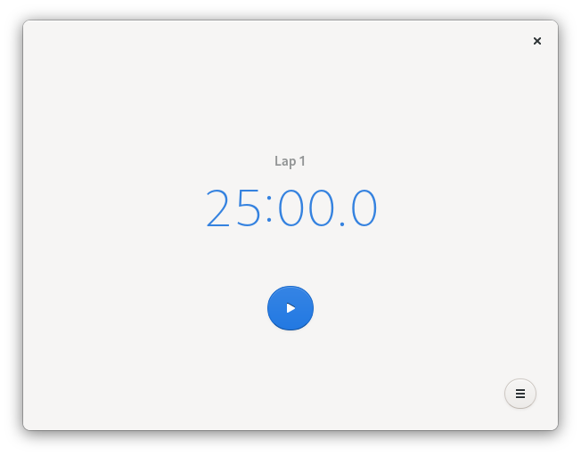

# Solanum



Solanum is a [pomodoro timer](https://en.wikipedia.org/wiki/Pomodoro_Technique) for the GNOME desktop. It keeps you on track, with frequent short breaks, and a long break after sessions of productivity.

## Building

### GNOME Builder (Recommended)

GNOME Builder is the environment used for developing this 
application. It can use Flatpak manifests to create a consistent building and running environment cross-distro. Thus, it is highly
recommended you use it.

1. Download [GNOME Builder](https://flathub.org/apps/details/org.gnome.Builder).
2. In Builder, click the "Clone Repository" button at the bottom, using `git@gitlab.gnome.org/BrainBlasted/Solanum.git`
or `https://gitlab.gnome.org/BrainBlasted/Solanum.git` as the URL.
3. Click the build button at the top once the project is loaded.

**Note: Solanum must be installed on the system for notifications to work. Please refer to the installation section below.**

### Manual

If you feel at home in the terminal or would like to build outside of Builder,
these are the commands to use:

```bash
git clone https://gitlab.gnome.org/BrainBlasted/Solanum.git
cd Solanum
meson _build --prefix=$PREFIX_DIR  # Defaults to /usr/local
ninja -C _build
```

## Installation

Depending on how you want it installed instructions can differ. If you
used GNOME Builder to build it, clicking the bar at the top window will 
open a submenu with "Export Bundle". This will create a flatpak bundle, 
which can be installed on any system that supports flatpak.

If you used the commands in the "Manual" section, or want to package for
distribution, you can use the following:

```bash
# Can be changed with the environment variable $DEST_DIR; defaults to prefix
ninja -C _build install 
```


## License information
```
Solanum: A pomodoro timer for GNOME
Copyright (C) 2020 Christopher Davis

This program is free software: you can redistribute it and/or modify
it under the terms of the GNU General Public License as published by
the Free Software Foundation, either version 3 of the License, or
(at your option) any later version.

This program is distributed in the hope that it will be useful,
but WITHOUT ANY WARRANTY; without even the implied warranty of
MERCHANTABILITY or FITNESS FOR A PARTICULAR PURPOSE.  See the
GNU General Public License for more details.

You should have received a copy of the GNU General Public License
along with this program.  If not, see <http://www.gnu.org/licenses/>.
```
